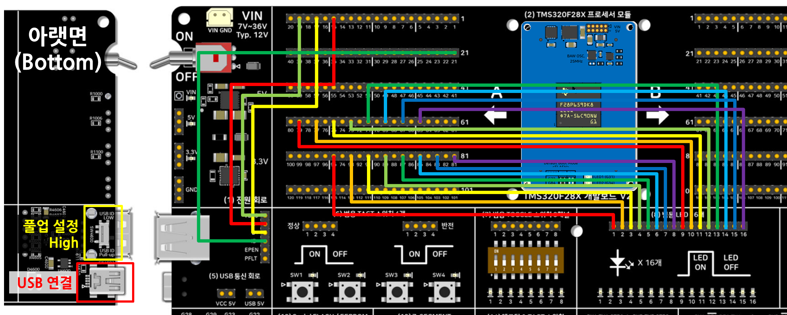

# USB 디바이스(MSC) 가상 이동식 디스크 — DriverLib 버전 — TMS320F28P65x

TMS320F28X 개발보드 V2의 회로블록 **(5) USB 통신 회로**를 통해 F28P65x의 USB0를 **디바이스
(Device) 모드의 대용량 저장장치(MSC, Mass Storage Class)**로 동작시킵니다. 외장 SD카드나
플래시 없이 칩 내부 RAM에 64KB 가상 FAT12 파일시스템을 메모리 테이블로 만들어 두고, PC에
USB 케이블을 꽂으면 윈도우 탐색기에 `F28P659` 이동식 디스크가 나타납니다. 순수 DriverLib +
TI USB Library(usblib)로 제작되었으며 SysConfig를 쓰지 않습니다.

## 가상 드라이브의 파일 3개

```
F28P659 (이동식 디스크)
├── README.TXT   보드 개요와 사용법 (읽기 전용)
├── STATUS.TXT   실시간 센서/스위치/전압 상태 (열 때마다 동적으로 갱신)
└── CONFIG.INI   보드 제어 파라미터 (메모장으로 수정 후 저장하면 즉시 반영)
```

- **README.TXT**: F28P659 칩 사양과 조작법 안내문입니다.
- **STATUS.TXT**: PC에서 파일을 열거나 `F5`(새로고침)를 누를 때마다 F28P65x가 가변저항 ADC
  전압, 택트 스위치(1~4번), 토글 스위치(1~8번), 시스템 가동시간(Uptime), 현재 LED 점등
  상태를 텍스트로 새로 만들어 보여줍니다. 별도 PC 프로그램 없이 메모장만으로 보드 상태를
  볼 수 있습니다.
- **CONFIG.INI**: 메모장으로 열어 아래 값을 고치고 `Ctrl + S`로 저장하면, F28P65x가 PC의
  `SCSI_WRITE_10` 섹터 쓰기를 가로채 파싱해 LED 패턴과 PWM 듀티를 바로 바꿉니다.
  ```ini
  LED_PATTERN  = 2   ; 1: 순차 점등, 2: 왕복 점등, 3: 전체 깜빡임, 4: 이진 카운터
  LED_SPEED_MS = 100 ; 점등 속도 (20 ~ 2000 ms)
  PWM_DUTY_PCT = 50  ; PWM 듀티 (0 ~ 100 %)
  ```

## 요구 하드웨어
- SyncWorks TMS320F28X 개발보드 V2
- TMS320F28P650DK9 또는 TMS320F28P659DK8-Q1 모듈
- USB 케이블 1개 (PC ↔ 보드 BOTTOM면 Mini-B 5핀 커넥터)
- 점퍼 케이블: USB용 4개 + LED16용 16개(권장), 스위치/가변저항 블록용(선택)

## 배선

(5) USB 통신 회로는 F2837x/F2838x용 ControlCARD 구성이라, F28P65x 모듈에서는 A Side
핀-헤더에서 (5)번 블록의 USB 인터페이스 핀-헤더까지 점퍼 케이블로 직접 연결해야 합니다.

| 신호 | 연결 |
|---|---|
| USB D- | **A Side 핀-헤더 15번**(GPIO42, USB0DM) → (5) 블록 "D-" 핀 |
| USB D+ | **A Side 핀-헤더 17번**(GPIO43, USB0DP) → (5) 블록 "D+" 핀 |
| USB VBUS | **A Side 핀-헤더 19번**(GPIO46) → (5) 블록 "VBUS" 핀 (PC USB 5V 전원 감지) |
| USB ID | **A Side 핀-헤더 21번**(GPIO47) → (5) 블록 "ID" 핀 |
| LED | 개발보드 **A Side 핀-헤더 65, 67, 69, 71, 73, 75, 77, 79, 81, 83, 85, 87, 89, 91, 93, 95번**(홀수, GPIO0~GPIO15에 순서대로 1:1 대응)을 **(8) 범용 LED 16개** 블록 입력 16핀에 순서대로 연결 (권장, `CONFIG.INI` 변경을 눈으로 확인) |
| 택트 스위치 1~4 | **A Side 핀-헤더 29, 27, 25, 23번**(GPIO70, 69, 68, 67) → (6) 블록 SW1~SW4 (선택, `STATUS.TXT`에 표시) |
| 토글 스위치 1~8 | **A Side 핀-헤더 115, 113, 111, 109, 107, 105, 103, 101번**(GPIO25~GPIO18) → (7) 블록 1~8번 (선택, `STATUS.TXT`에 표시) |
| 가변저항 | **B Side 핀-헤더 111번**(ADCINA0) → (9) 가변전압 블록 출력 (선택, `STATUS.TXT`에 표시) |

- PC 케이블은 반드시 개발보드 **BOTTOM면의 Mini-B 5핀 USB 커넥터**에 연결하세요. TOP면의
  Type-A 커넥터는 마우스/메모리를 꽂는 호스트 전용입니다.
- BOTTOM면의 **USB ID 풀업 스위치**는 디바이스 모드이므로 ID 핀을 풀업(High)하는 쪽으로
  설정하세요.
- 디바이스 모드에서는 PC가 VBUS 전원을 공급하므로 USB 호스트 예제에서 쓰던 EPEN/PFLT(B Side
  45/47번) 배선은 필요하지 않습니다.



위 사진은 USB 신호 4개와 LED16 블록의 결선, 그리고 BOTTOM면의 USB ID 풀업 스위치(High)와
Mini-B 연결 위치를 보여줍니다.

## 동작 방식
1. **USB 60MHz 클럭**: F28P65x의 USB 컨트롤러는 AUXPLL 60MHz 클럭이 필요하므로
   `SysCtl_setAuxClock(DEVICE_AUXSETCLOCK_CONFIG_USB)`로 설정합니다.
2. **USB 핀 활성화**: `USBGPIOEnable()`(`usb_hal.c`)이 GPIO42/43(DM/DP)을 아날로그 모드로,
   GPIO46/47(VBUS 감지/ID)을 입력으로 설정합니다.
3. **USB 인터럽트**: `Interrupt_register(INT_USBA, &USBDevMSC_intHandler)`로 연결합니다.
4. **MSC 스택**: `USBDevMSC_init()`이 디바이스 모드로 버스에 연결하고, 메인 루프가
   `USBDevMSC_process()`를 계속 호출해 BOT(Bulk-Only Transport) 상태 머신과 SCSI-2 명령을
   처리합니다.
5. **가상 FAT12**: `virtual_disk.c`가 LBA 0~7 섹터(부트 섹터, FAT, 루트 디렉터리, 파일
   데이터)를 요청 때마다 즉석에서 만들어 돌려줍니다. `STATUS.TXT` 섹터는 읽는 순간의
   센서값으로 새로 생성되고, `CONFIG.INI` 섹터에 쓰기가 들어오면 `config_parser.c`가
   파싱해 LED 패턴/속도/PWM 듀티에 반영합니다.
6. **메인 루프**: 1ms 타임베이스로 10ms마다 센서/스위치를 읽고, 설정된 속도로 LED 패턴을
   갱신하며, 1초마다 가동시간을 올립니다.

## 장치관리자에서 보이는 이름
윈도우 장치관리자의 "디스크 드라이브"에는 SCSI INQUIRY 응답의 제조사(8자)와 제품명(16자)
필드가 합쳐져 표시됩니다. 제조사 필드는 8자 제한이라 `SyncWorks`(9자)가 들어갈 수 없어서,
제조사 필드는 공백으로 두고 제품명 필드에 `SyncWorks Disk`를 넣었습니다
(`usb_dev_msc.c`의 `s_scsiInquiryData`). USB 문자열 디스크립터의 제조사는 `SyncWorks`,
제품명은 `F28P659 Virtual Disk`입니다.

## 소프트웨어 구성
- CCS: 21.x (Theia 기반)
- **SysConfig 미사용** — `products="C2000WARE"`만 사용
- C2000Ware 26.00.00.00 — `device/`, `driverlib.lib`, USB Library 헤더(`usb/include/`)와
  `usblib.lib`를 이 폴더 안에 복사해 두어 C2000Ware 설치 경로에 의존하지 않습니다.
- Code Generation Tools: 22.6.3.LTS
- 컴파일러 정의 `--define=ccs_c2k`(usblib.h가 TI CCS/C2000 컴파일러임을 식별)와 `--c99`
  필수 — `.projectspec`에 이미 반영되어 있습니다.

```
5_USB_Dev_MSC_Driverlib/
├── 5_USB_Dev_MSC_Driverlib.c   main 루프, 하드웨어 초기화 (PLL 200MHz, GPIO, ADC, PWM)
├── usb_dev_msc.c / .h          USB BOT 및 SCSI-2 프로토콜 엔진
├── virtual_disk.c / .h         가상 FAT12 파일시스템 섹터 생성기 (LBA 0~7)
├── config_parser.c / .h        CONFIG.INI 파서 및 실시간 하드웨어 반영
├── status_generator.c / .h     STATUS.TXT 실시간 센서값 문자열 생성기
├── usb_hal.c / .h              USB 핀 설정 및 하드웨어 래퍼
├── c28x_uint8_compat.h         C28x stdint.h가 uint8_t를 정의하지 않아 추가한 호환 shim
├── monitor_status.bat          STATUS.TXT 주기 확인용 보조 스크립트
├── driverlib.lib / usblib.lib  F28P65x 공식 라이브러리
└── CCS/                        CCS 프로젝트스펙
```

## Import → Build → Flash → Run
1. CCS에서 `CCS/5_USB_Dev_MSC_Driverlib.projectspec`를 Import
2. Build (CPU1_RAM 또는 CPU1_FLASH)
3. Debug 연결 후 Flash/Run
4. 보드 BOTTOM면 Mini-B 커넥터를 PC에 연결

## 정상 동작 확인
- 탐색기에 `F28P659` 이동식 디스크가 나타나고, `README.TXT`/`STATUS.TXT`/`CONFIG.INI`가
  보입니다.
- `STATUS.TXT`를 열고 `F5`를 누를 때마다 Uptime이 올라가고, 스위치/가변저항을 조작하면
  값이 바뀌어야 합니다.
- `CONFIG.INI`의 `LED_PATTERN`을 바꿔 저장하면 LED 점등 패턴이 바로 바뀌어야 합니다.

## 메모리 사용량 (CPU1_RAM 빌드 실측, 2026-10-01)

`C:/Users/vosam/workspace_ccstheia/5_USB_Dev_MSC_*/CPU1_RAM/*.map`을 실제로 빌드해 링커
맵의 온칩 RAM 사용량을 합산한 값입니다(플래시가 아닌 RAM 로드 구성 기준, 링커 cmd가
매핑하는 레지스터 윈도우는 제외). 링커 옵션의 스택 2KB(`--stack_size=0x800`)가 포함됩니다.

| | 비트필드 | **DriverLib(이 폴더)** | FreeRTOS |
|---|---|---|---|
| 합계 | 18,701 B (18.3 KB) | **26,169 B (25.6 KB)** | 31,759 B (31.0 KB) |

비트필드 버전이 가장 작고, FreeRTOS 버전은 커널 코드/데이터가 더해져 가장 큽니다.

## 빌드 검증 메모 (2026-09-20)

이 예제를 DriverLib/비트필드/FreeRTOS 3버전으로 정리하면서 실제 `cl2000`으로 CPU1_RAM/
CPU1_FLASH 링크까지 처음으로 검증했습니다. 그 과정에서 발견해 고친 실제 버그들:

- `SysCtl_setAuxClock(DEVICE_AUXSETCLOCK_CFG_USB)` → 실제 매크로 이름은
  `DEVICE_AUXSETCLOCK_CONFIG_USB`(오탈자로 정의되지 않은 매크로를 참조하고 있었음)
- `USB0_BASE` → F28P65x driverlib에는 존재하지 않는 이름, 실제로는 `USBA_BASE`
- `usb_dev_msc.c`에서 `USBEndpointDataGet()`의 4번째 인자(버퍼 크기, `uint32_t*` 포인터)
  자리에 `sizeof(...)` 값을 정수로 직접 전달하던 3곳 — 실행 시 그 정수값을 주소로
  잘못 역참조해 크래시할 수 있는 버그였음. 지역 `uint32_t` 변수를 만들어 주소를
  넘기도록 수정
- `__attribute__((packed))` (GCC 전용 문법) — TI cl2000 컴파일러는 인식하지 못해 제거
  (C28x는 8비트 addressable unit이 없어 애초에 구조체 패킹의 의미가 다름)
- `virtual_disk.h`/`status_generator.h`가 `uint8_t`를 쓰는데 C28x의 TI `stdint.h`는 이
  아키텍처에서 `uint8_t`/`int8_t`를 정의하지 않음 — `c28x_uint8_compat.h` shim 추가
- 링커 cmd 파일의 `.stack`(RAMM1, 1KB)과 `.data`(RAMLS5)가 이 예제의 USB 디스크립터·
  가변 문자열 데이터량에 비해 너무 작아 실기 빌드에서 링크 실패 — `.stack`은 RAMLS7로,
  `.data`는 RAMGS0으로, `.const`는 RAMLS6/RAMGS3/RAMGS4로 분산 배치해 해결

## 세 가지 버전 비교
같은 USB MSC 가상 이동식 디스크 데모를 세 가지 방식으로 구현해 비교합니다.

| 버전 | 폴더 | 핵심 차이 |
|---|---|---|
| **DriverLib(이 폴더)** | 5_USB_Dev_MSC_Driverlib | TI 표준 HAL 함수 호출 |
| 비트필드 | [5_USB_Dev_MSC_Bitfield](../5_USB_Dev_MSC_Bitfield/) | 애플리케이션 코드는 레지스터 구조체 직접 조작(usblib.lib + 공유 USB 엔진의 숨은 driverlib 의존성만 링크) |
| FreeRTOS | [5_USB_Dev_MSC_Freertos](../5_USB_Dev_MSC_Freertos/) | DriverLib + 태스크 스케줄링, 정적 할당 |

## 관련 링크
- 상품 페이지: https://tms320f28x.co.kr/goods/goods_view.php?goodsNo=200903127
- 게시판 글: https://tms320f28x.co.kr/board/view.php?bdId=tms320f28xevmv2- 게시판 글: (게시 후 URL 추가 예정)sno=111
- 유튜브 영상: (게시 후 URL 추가 예정)
